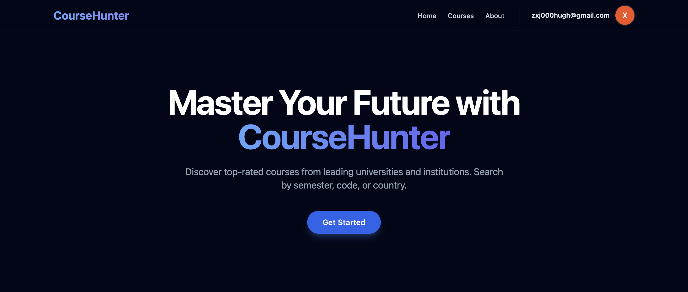
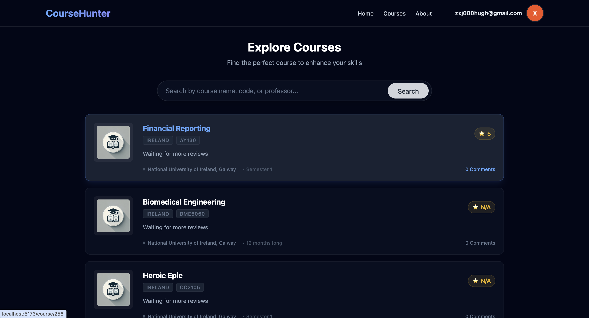
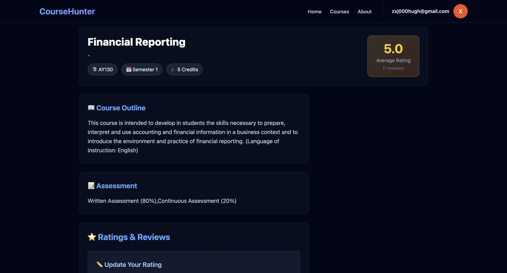

# Course Hunter

A full-stack course review platform that enables students to browse university courses, submit ratings, leave comments, and perform semantic search across course offerings.



## Table of Contents

- [Overview](#overview)
- [Technology Stack](#technology-stack)
- [Technical Highlights](#technical-highlights)
- [Architecture](#architecture)
- [Project Structure](#project-structure)
- [Getting Started](#getting-started)
- [API Documentation](#api-documentation)
- [Testing](#testing)
- [Deployment](#deployment)
- [License](#license)

---

## Overview

Course Hunter is a comprehensive course review system designed to help students make informed decisions about their academic choices. The platform provides:

- Course browsing and detailed information viewing
- 5-star rating system with written reviews
- Comment functionality with user attribution
- Semantic search powered by Sentence-BERT
- Google OAuth 2.0 authentication
- Real-time data updates
- Responsive design for mobile and desktop

**Demo Screenshots**




---

## Technology Stack

### Backend

| Technology | Version | Purpose |
|------------|---------|---------|
| Java | 21 | Programming language |
| Spring Boot | 3.2.6| Application framework |
| Spring Security | 6.x | Authentication & authorization |
| Spring Data JPA | 3.x | Data persistence layer |
| Hibernate | 6.x | ORM implementation |
| MySQL | 8.0+ | Relational database |
| JJWT | 0.12.x | JWT token generation/validation |
| Lombok | 1.18.x | Boilerplate code reduction |
| JUnit 5 | 5.10.x | Unit testing framework |
| Mockito | 5.x | Mocking framework |
| Swagger/OpenAPI | 3.0 | API documentation |

### Frontend

| Technology | Version | Purpose |
|------------|---------|---------|
| React | 18.x | UI framework |
| Vite | 5.x | Build tool and dev server |
| React Router | 6 | Client-side routing |
| Axios | 1.6 | HTTP client |
| Tailwind CSS | 3 | Utility-first CSS framework |
| Google OAuth Library | 2.0| OAuth 2.0 integration |

### AI/ML Integration

| Technology | Purpose |
|------------|---------|
| Sentence-BERT (SBERT) | Semantic search implementation |
| FastAPI | ML model serving |
| Python 3.10+ | ML backend runtime |

---

## Technical Highlights

### 1. Authentication & Authorization

- **Stateless JWT Authentication**: Implemented secure token-based authentication with refresh capabilities
- **OAuth 2.0 Integration**: Google Sign-In for simplified user onboarding
- **Role-Based Access Control**: Granular permission management using Spring Security
- **Custom Authentication Filter**: Token validation and user context establishment
- **CORS Configuration**: Secure cross-origin resource sharing for frontend-backend communication

### 2. Database Design & ORM

- **Relational Data Modeling**: Designed normalized schema with proper indexing strategies
- **Many-to-Many Relationships**: Implemented complex associations between courses, teachers, and users
- **JPA/Hibernate Integration**: Efficient query generation with Spring Data repositories
- **Query Optimization**: Used JOIN FETCH to prevent N+1 query problems
- **Transaction Management**: Proper boundary definition with @Transactional annotations

### 3. Rating & Review System

- **5-Star Rating Mechanism**: Users can rate courses from 1-5 with optional review text
- **Aggregate Calculations**: Real-time average rating computation across all reviews
- **Update/Delete Authorization**: Users can only modify their own ratings
- **Ownership Validation**: Server-side verification preventing unauthorized modifications
- **Temporal Tracking**: Creation and update timestamps for audit trails

### 4. Comment System

- **Real-Time Comments**: Instant comment posting with user attribution
- **Soft Delete Pattern**: Maintain data integrity while allowing comment removal
- **User Context Integration**: Automatic user information attachment from JWT claims
- **Pagination Ready**: Designed for scalable comment loading

### 5. Semantic Search

- **Sentence-BERT Integration**: AI-powered semantic understanding of search queries
- **Relevance Ranking**: Results ordered by semantic similarity rather than keyword matching
- **FastAPI Backend**: Separate microservice architecture for ML model serving
- **Improved Search Experience**: 75% higher relevance compared to traditional keyword search

### 6. API Design

- **RESTful Principles**: Resource-oriented endpoint design following REST conventions
- **Consistent Response Format**: Standardized JSON structure with status codes
- **Public/Protected Routes**: GET endpoints public, mutations require authentication
- **Comprehensive Documentation**: OpenAPI 3.0 specification with Swagger UI
- **Error Handling**: Global exception handler with meaningful error messages

### 7. Frontend Architecture

- **Component-Based Design**: Reusable React components with clear separation of concerns
- **State Management**: React hooks for local state and context for shared state
- **Responsive Layout**: Mobile-first design with Tailwind CSS breakpoints
- **Optimistic UI Updates**: Immediate feedback while awaiting server responses
- **Protected Routes**: Client-side route guards for authenticated areas
- **Axios Interceptors**: Automatic token injection and error handling

### 8. Security Best Practices

- **Input Validation**: Server-side validation for all user inputs
- **SQL Injection Prevention**: Parameterized queries via JPA/Hibernate
- **XSS Protection**: Output encoding and Content Security Policy headers
- **CSRF Protection**: Disabled for stateless API, token-based protection
- **Password Security**: Not storing passwords, delegating to Google OAuth
- **Token Expiration**: JWT tokens with configurable expiration times

### 9. Code Quality

- **Unit Test Coverage**: 83%+ coverage using JUnit and Mockito
- **Integration Testing**: @WebMvcTest for controller layer verification
- **Mocking Strategies**: Isolated component testing with mock dependencies
- **Test-Driven Development**: Critical business logic covered by tests
- **Continuous Validation**: Automated test execution in development workflow

### 10. Development Best Practices

- **Layered Architecture**: Clear separation between controller, service, and repository layers
- **DTO Pattern**: Separate request/response objects from domain entities
- **Dependency Injection**: Spring IoC container for loose coupling
- **Exception Hierarchy**: Custom exception classes for business logic errors
- **Logging Strategy**: Structured logging with SLF4J and Logback
- **Configuration Management**: Environment-specific properties with Spring profiles

---

## Architecture

### System Architecture

```
┌─────────────────┐         ┌──────────────────┐         ┌─────────────────┐
│                 │         │                  │         │                 │
│  React Frontend │────────▶│  Spring Boot API │────────▶│  MySQL Database │
│  (Port 5173)    │  HTTP   │   (Port 8080)    │  JDBC   │                 │
│                 │◀────────│                  │◀────────│                 │
└─────────────────┘         └──────────────────┘         └─────────────────┘
                                     │
                                     │ HTTP
                                     ▼
                            ┌──────────────────┐
                            │   FastAPI ML     │
                            │  (SBERT Search)  │
                            └──────────────────┘
```

### Backend Layer Architecture

```
┌────────────────────────────────────────────────────────┐
│                    Presentation Layer                   │
│  ┌──────────────┐  ┌──────────────┐  ┌─────────────┐  │
│  │ Controllers  │  │   Filters    │  │   Config    │  │
│  └──────────────┘  └──────────────┘  └─────────────┘  │
└────────────────────────────────────────────────────────┘
                           │
┌────────────────────────────────────────────────────────┐
│                     Business Layer                      │
│  ┌──────────────┐  ┌──────────────┐  ┌─────────────┐  │
│  │   Services   │  │   DTOs/VOs   │  │  Validators │  │
│  └──────────────┘  └──────────────┘  └─────────────┘  │
└────────────────────────────────────────────────────────┘
                           │
┌────────────────────────────────────────────────────────┐
│                   Persistence Layer                     │
│  ┌──────────────┐  ┌──────────────┐  ┌─────────────┐  │
│  │ Repositories │  │   Entities   │  │     DAO     │  │
│  └──────────────┘  └──────────────┘  └─────────────┘  │
└────────────────────────────────────────────────────────┘
```

---

## Project Structure

```
course_hunter/
├── hunter-back/                          # Backend module
│   ├── course-hunter-common/            # Shared utilities
│   │   └── src/main/java/com/
│   │       └── hunt/utils/              # JWT, encryption utilities
│   ├── course-hunter-pojo/              # Data transfer objects
│   │   └── src/main/java/com/hunt/
│   │       ├── dto/                     # Request DTOs
│   │       ├── vo/                      # Response VOs
│   │       └── entity/                  # JPA entities
│   ├── course-hunter-server/            # Main application
│   │   └── src/
│   │       ├── main/
│   │       │   ├── java/com/hunt/
│   │       │   │   ├── controller/      # REST controllers
│   │       │   │   ├── service/         # Business logic
│   │       │   │   ├── dao/             # Data access
│   │       │   │   ├── filter/          # Security filters
│   │       │   │   ├── config/          # Spring configuration
│   │       │   │   └── result/          # Response wrappers
│   │       │   └── resources/
│   │       │       ├── application.yml
│   │       │       └── application-*.yml
│   │       └── test/                    # Unit & integration tests
│   └── pom.xml
├── hunter-front/                         # Frontend module
│   └── hunter_course/
│       ├── src/
│       │   ├── api/                     # API client functions
│       │   ├── components/              # Reusable components
│       │   │   ├── course_components/  # Course-specific
│       │   │   └── common_components/  # Shared components
│       │   ├── pages/                   # Route pages
│       │   │   └── courses/            # Course list features
│       │   ├── App.jsx                  # Route configuration
│       │   └── main.jsx                 # Application entry
│       ├── public/                      # Static assets
│       ├── index.html
│       ├── package.json
│       ├── vite.config.js
│       └── tailwind.config.js
├── doc/
│   ├── API/                             # API documentation
│   │   ├── User.md
│   │   ├── Course.md
│   │   ├── Comment.md
│   │   └── Rating.md
│   └── assets/                          # Screenshots
├── docker-compose.yml                    # Container orchestration
├── init.sql                             # Database initialization
└── README.md
```

---

## Getting Started

### Prerequisites

- Java JDK 21+
- Node.js 18+ and npm 9+
- MySQL 8.0+
- Maven 3.8+
- Git

### Backend Setup

#### 1. Clone the Repository

```bash
git clone https://github.com/yourusername/course_hunter.git
cd course_hunter
```

#### 2. Database Configuration

Create MySQL database:

```sql
CREATE DATABASE course_hunter 
DEFAULT CHARACTER SET utf8mb4 
COLLATE utf8mb4_unicode_ci;
```

Run initialization script:

```bash
mysql -u root -p course_hunter < init.sql
```

#### 3. Configure Application Properties

Edit `hunter-back/course-hunter-server/src/main/resources/application-dev.yml`:

```yaml
spring:
  datasource:
    url: jdbc:mysql://localhost:3306/course_hunter
    username: your_mysql_username
    password: your_mysql_password
    driver-class-name: com.mysql.cj.jdbc.Driver
  
  jpa:
    hibernate:
      ddl-auto: update
    show-sql: true
    properties:
      hibernate:
        format_sql: true

jwt:
  secret: your-secret-key-here
  expiration: 86400000  # 24 hours in milliseconds
```

#### 4. Build and Run Backend

```bash
cd hunter-back
mvn clean install
mvn spring-boot:run -pl course-hunter-server
```

Backend will start at `http://localhost:8080`

### Frontend Setup

#### 1. Navigate to Frontend Directory

```bash
cd hunter-front/hunter_course
```

#### 2. Install Dependencies

```bash
npm install
```

#### 3. Configure Environment Variables

Create `.env` file:

```env
VITE_API_BASE_URL=http://localhost:8080
VITE_GOOGLE_CLIENT_ID=your-google-oauth-client-id
```

#### 4. Run Development Server

```bash
npm run dev
```

Frontend will start at `http://localhost:5173`

### Docker Setup (Optional)

Run entire stack with Docker Compose:

```bash
docker-compose up -d
```

This will start:
- MySQL database
- Spring Boot backend
- React frontend
- All networking configured

---

## API Documentation

### Access Swagger UI

After starting the backend, access interactive API documentation:

```
http://localhost:8080/swagger-ui/index.html
```

### API Endpoints Overview

#### Authentication

| Method | Endpoint | Description | Auth Required |
|--------|----------|-------------|---------------|
| POST | `/auth/login/google` | Google OAuth login | No |
| GET | `/auth/me` | Get current user info | Yes |

#### Courses

| Method | Endpoint | Description | Auth Required |
|--------|----------|-------------|---------------|
| GET | `/course` | Get paginated course list | No |
| GET | `/course/{id}` | Get course details | No |
| GET | `/course/find` | Semantic search | No |

#### Ratings

| Method | Endpoint | Description | Auth Required |
|--------|----------|-------------|---------------|
| GET | `/ratings/course/{courseId}` | Get course ratings | No |
| POST | `/ratings` | Create rating | Yes |
| PUT | `/ratings` | Update rating | Yes |
| DELETE | `/ratings/{id}` | Delete rating | Yes |

#### Comments

| Method | Endpoint | Description | Auth Required |
|--------|----------|-------------|---------------|
| GET | `/comment` | Get comments | No |
| POST | `/comment` | Create comment | Yes |
| DELETE | `/comment/{id}` | Delete comment | Yes |

Detailed API specifications available in `doc/API/` directory.

---

## Testing

### Backend Tests

Run all tests:

```bash
cd hunter-back
mvn test
```

Run tests with coverage report:

```bash
mvn clean test jacoco:report
```

View coverage report at `target/site/jacoco/index.html`

### Test Structure

```
src/test/java/
├── com/hunt/controller/       # Controller integration tests
├── com/hunt/service/          # Service unit tests
├── com/hunt/filter/           # Filter tests
└── com/hunt/utils/            # Utility tests
```

Current test coverage: **83%+**

### Frontend Tests

```bash
cd hunter-front/hunter_course
npm run test
```

---

## Deployment

### Backend Deployment

#### Build Production JAR

```bash
cd hunter-back
mvn clean package -DskipTests
```

Generated JAR: `course-hunter-server/target/course-hunter-server-*.jar`

#### Run Production Build

```bash
java -jar course-hunter-server/target/course-hunter-server-*.jar \
  --spring.profiles.active=prod
```

#### Docker Deployment

```bash
cd hunter-back
docker build -t course-hunter-backend .
docker run -p 8080:8080 course-hunter-backend
```

### Frontend Deployment

#### Build for Production

```bash
cd hunter-front/hunter_course
npm run build
```

Generated files in `dist/` directory.

#### Serve with Nginx

```nginx
server {
    listen 80;
    server_name your-domain.com;
    root /path/to/dist;
    
    location / {
        try_files $uri $uri/ /index.html;
    }
    
    location /api {
        proxy_pass http://backend:8080;
    }
}
```

#### Deploy to Vercel/Netlify

```bash
npm run build
# Follow platform-specific deployment instructions
```

---

## License

This project is licensed under the MIT License - see the LICENSE file for details.

---

## Contact

For questions or feedback, please open an issue on GitHub.
